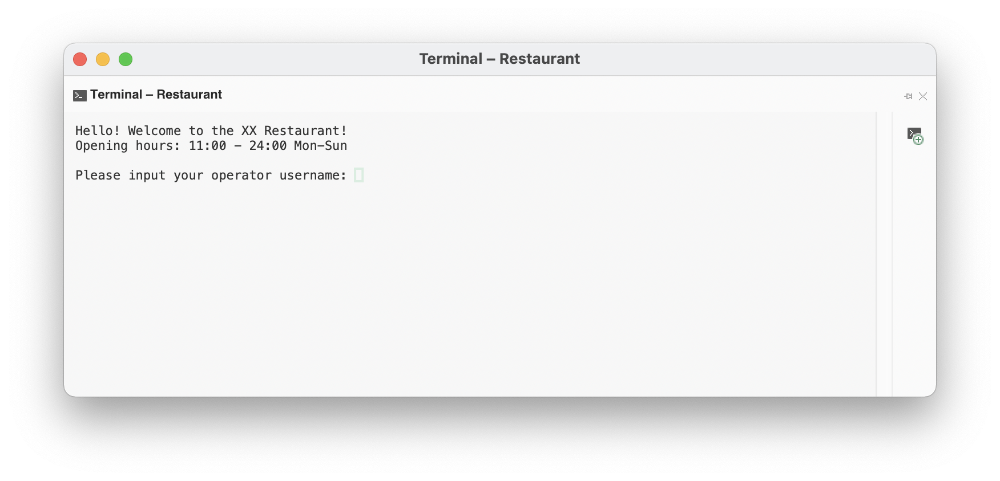
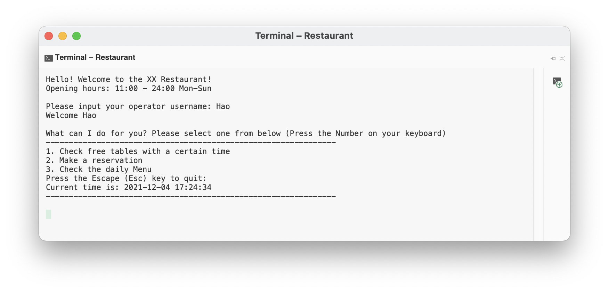
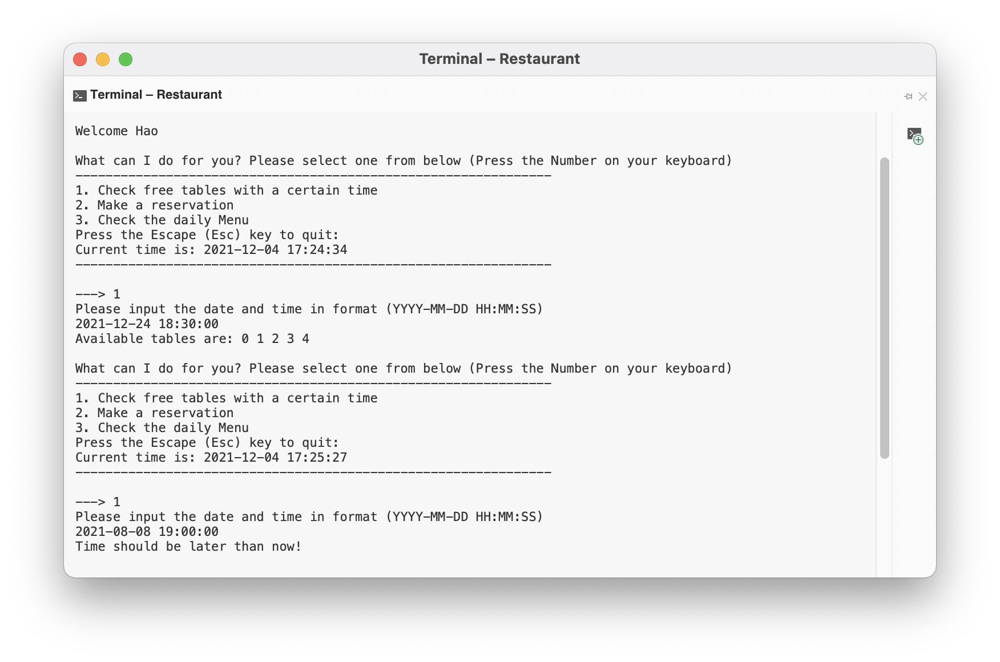
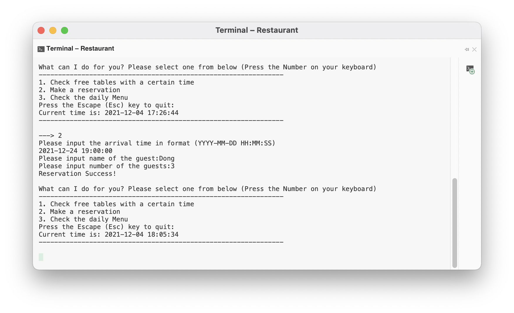
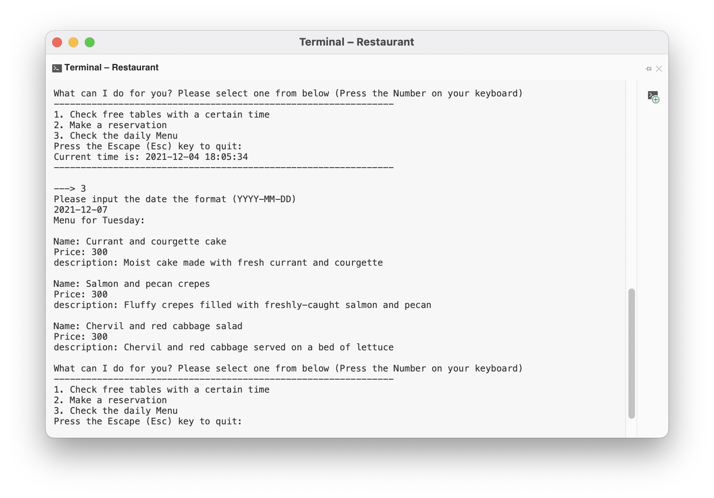
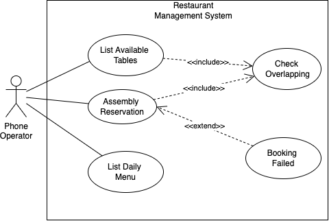
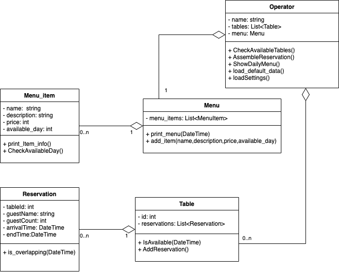
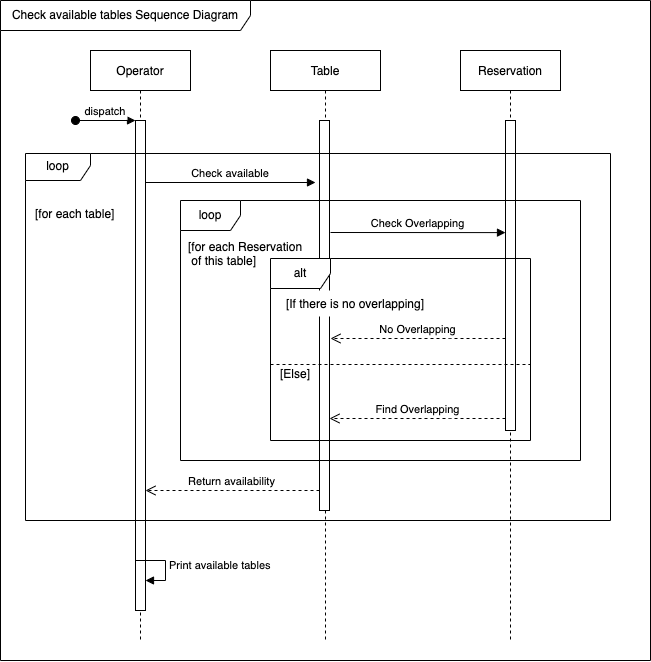
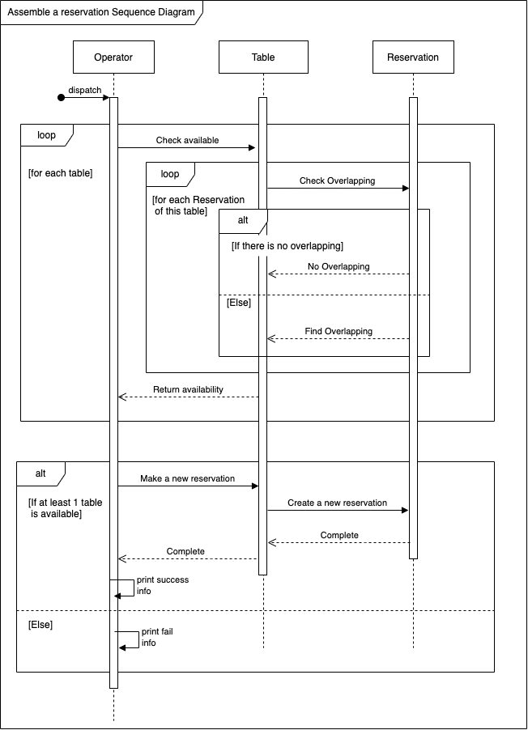

# ​DEVELOPMENT OF SOFTWARE APPLICATIONS - FALL 2021-<br> HOMEWORK SUBMISSION REPORT​

- **Author:** Name
- **Task:** Restaurant management

---
Table of Contents:
  - [**1. Task1**](#1-task1)
    - [**Description of the exercise**](#description-of-the-exercise)
    - [**Solution and explanation**](#solution-and-explanation)
  - [**2. Task2**](#2-task2)
    - [**Description of the exercise**](#description-of-the-exercise-1)
    - [**Solution and explanation**](#solution-and-explanation-1)
  - [**3. Task3**](#3-task3)
    - [**Description of the exercise**](#description-of-the-exercise-2)
    - [**Solution and explanation**](#solution-and-explanation-2)
  - [**4. UML Use Case Diagram**](#4-uml-use-case-diagram)
  - [**5. UML Class Diagram**](#5-uml-class-diagram)
  - [**6. UML Sequence Diagrams**](#6-uml-sequence-diagrams)
  - [**7. Extra Work**](#7-extra-work)
---

## **1. Task1**
### **Description of the exercise**

> Can list available tables (depending on the time)

### **Solution and explanation**

After the phone operater enters his/her name, there will be a option menu for 3 different tasks, as below

```c#
Console.WriteLine("What can I do for you? Please select one from below (Press the Number on your keyboard)");
Console.WriteLine("---------------------------------------------------------------");
Console.WriteLine("1. Check free tables with a certain time");
Console.WriteLine("2. Make a reservation");
Console.WriteLine("3. Check the daily Menu");
Console.WriteLine("Press the Escape (Esc) key to quit:");
Console.WriteLine("Current time is: {0}", DateTime.Now.ToString("yyyy-MM-dd HH:mm:ss"));
Console.WriteLine("---------------------------------------------------------------\n");
input = Console.ReadKey(true);
```

Then user can use the number 1 key on the keyboard to choose `option 1`, then if statement will go to the section below. Here `op` is a object of Class `Operator`

```c#
// option 1
if (input.Key == ConsoleKey.D1)
{
    Console.Write("---> 1\n");
    Console.WriteLine("Please input the date and time in format (YYYY-MM-DD HH:MM:SS)");
    string date = Console.ReadLine();

    // first check if the input string can be parsed to 'DateTime' data type
    if (DateTime.TryParse(date, out datetime))
    {
        //operate will go and check the availabilities of all the tables
        op.CheckAvailableTables(datetime);
    }
    else
    {
        //invalid input string format
        Console.WriteLine("Sorry, your input time format is invalid.");
    }
}
```

In class `Operator`, the function `CheckAvailableTables` is below:

```c#
/*
check available tables
Parameters: DateTime
Return: Void
Procedures:
1) Valid time
2) Search for the availabilites of every table
3) Print results
*/
public void CheckAvailableTables(DateTime dateTime)
{
    // Check if the input time is 
    if (!validateTime(dateTime))
    {
        return;
    }

    Console.Write("Available tables are:");
    StringBuilder sb = new StringBuilder();
    // Search for every table
    foreach (var table in tables)
    {
        if (table.IsAvailable(dateTime))
        {
            sb.AppendFormat(" {0}",table.Id);
        }
    }
    if (sb.Length==0)
    {
        sb.Append(" Sorry, no available tables");
    }
    sb.Append("\n");
    Console.Write(sb.ToString());
}
```

In class `Table`, the function `IsAvailable` is below:

```c#
public bool IsAvailable(DateTime dateTime)
{
    if (_reservations.Count == 0)
    {
        return true;
    }
    else
    {
        foreach (var booking in _reservations)
        {
            // go through all the reservation, check if the time is overlapping
            if (!booking.IsOverlapping(dateTime))
            {
                return true;
            }
        }
        return false;
    }
}
```

In the class `Reservation`, the function `IsOverlapping` is below. Here the program supposes that the eating hour for each reservation is 2 hours.

```c#
public bool IsOverlapping(DateTime dateTime)
{
    if (dateTime.AddHours(2).CompareTo(_arrivalTime)<=0 || dateTime.CompareTo(_endTime)>=0)
    {
        return false;
    }
    else
    {
        return true;
    }
}
```

I tested the solution by running the application and below are screenshots of the result:

Login step
Option list
List tables depending on the time

## **2. Task2**

### **Description of the exercise**

> Can assembly reservation by setting the time of the arrival, the number of guests, and name
of the person who books the table.

### **Solution and explanation**

After the phone operater enters his/her name, the application will load dafault data for it, as below.

```c#
/*
Class Operator
Load default settings
Parameters: 
Return:
Procedures:
1) add 5 tables
2) add menu items
*/
void loadSettings()
{
    // create 5 tables
    for (int i = 0; i < 5; i++)
    {
        tables.Add(new Table(i));
    }

    // create random menu items
    menu.AddMenuItem("Peach and strawberry biscuits", "Crunchy biscuits made with fresh peach and strawberries", 300, DayOfWeek.Monday);
    menu.AddMenuItem("Currant and courgette cake", "Moist cake made with fresh currant and courgette", 300, DayOfWeek.Tuesday);
    menu.AddMenuItem("Squash and monkfish curry", "Mild curry made with pattypan squash and monkfish", 300, DayOfWeek.Wednesday);
    menu.AddMenuItem("Plaice and pepper salad", "A crisp salad featuring plaice and orange pepper", 300, DayOfWeek.Thursday);
    menu.AddMenuItem("Venison and curly kale salad", "A crisp salad featuring venison and curly kale", 300, DayOfWeek.Friday);
    menu.AddMenuItem("Pancetta and avocado fusilli", "Fresh egg pasta in a sauce made from smoked pancetta and", 300, DayOfWeek.Saturday);
    menu.AddMenuItem("Garam masala and squash bread", "Crunchy bread made with garam masala and pattypan squash", 300, DayOfWeek.Sunday);
    menu.AddMenuItem("Duck and chilli skewers", "amboo skewers loaded with duck and firey chilli", 300, DayOfWeek.Monday);
    menu.AddMenuItem("Salmon and pecan crepes", "Fluffy crepes filled with freshly-caught salmon and pecan", 300, DayOfWeek.Tuesday);
    menu.AddMenuItem("Chervil and red cabbage salad", "Chervil and red cabbage served on a bed of lettuce", 300, DayOfWeek.Tuesday);
}
```

Then there will be a option menu for 3 different tasks, as shown in Task1

Then user can use the number 2 key on the keyboard to choose `option 2`, then if statement will go to the section below. Here `op` is a object of Class `Operator`

```c#
// option 2
if (input.Key == ConsoleKey.D2)
{
    Console.Write("---> 2\n");
    Console.WriteLine("Please input the arrival time in format (YYYY-MM-DD HH:MM:SS)");
    string date = Console.ReadLine();

    // first check if the input string can be parsed to 'DateTime' data type
    if (DateTime.TryParse(date, out datetime))
    {
        // request the guest name
        Console.Write("Please input name of the guest:");
        string guest_name = Console.ReadLine();
        // request the number of guests
        Console.Write("Please input number of the guests:");
        string guest_count_str = Console.ReadLine();
        int guest_count_num = Int32.Parse(guest_count_str);
        // make the reservation with the info above
        op.AssembleReservation(guest_name,guest_count_num,datetime);
    }
    else
    {
        //invalid input string format
        Console.WriteLine("Sorry, your input time format is invalid.");
    }
}
```

In class `Operator`, the function `AssembleReservation` is below. It will print if the reserversion successes.

```c#
/*
make the reservation
Parameters: string guest_name, int guest_count, DateTime arrival_time
Return: bool
Procedures:
1) Valid time
2) Add the reservation to the first availble table
3) Print results
*/
public bool AssembleReservation(string guest_name, int guest_count, DateTime arrival_time)
{
    if (!validateTime(arrival_time))
    {
        Console.WriteLine("Reservation Failed");
        return false;
    }

    foreach (var table in tables)
    {
        if (table.AddReservation(guest_name,guest_count,arrival_time))
        {
            Console.WriteLine("Reservation Success!");
            return true;
        }
    }
    Console.WriteLine("Reservation Failed");
    return false;
}
```

In the class `Table`, the function `AddReservation` is below.

```c#
/*
Class Table
Add reservation to the table
Parameters: string guest_name, int guest_count, DateTime arrival_time
Return: bool (true if success, false otherwise)
Procedures:
1) check if it is available with the given time
2) make the reservation
*/
public bool AddReservation(string guest_name, int guest_count, DateTime arrival_time)
{

    if (IsAvailable(arrival_time))
    {
        _reservations.Add(new Reservation(this._id, guest_name, guest_count, arrival_time));
        return true;
    }
    else
    {
        return false;
    }
}
```

In the class `Reservation`, the constructor is below.

```c#
public Reservation(int n, string guest_name, int guest_count, DateTime arrival_time)
{
    this._tableId = n;
    this._guestName = guest_name;
    this._guestCount = guest_count;
    this._arrivalTime = arrival_time;
    // suppose each meal will last 2 hours
    this._endTime = this._arrivalTime.AddHours(2);
}
```

I tested the solution by running the application and below is a screenshot of the result.

Assemble a reservation with guest name, number of guests and arrival time: 

## **3. Task3**

### **Description of the exercise**

> Can list the daily menu

### **Solution and explanation**

After the phone operater enters his/her name, the application will load dafault data for it, as shown in Task2.

Then there will be a option menu for 3 different tasks, as shown in Task1

Then user can use the number 3 key on the keyboard to choose `option 3`, then if statement will go to the section below. Here `op` is a object of Class `Operator`

```c#
// option 3
if (input.Key == ConsoleKey.D3)
{
    Console.Write("---> 3\n");
    Console.WriteLine("Please input the date the format (YYYY-MM-DD)");
    string date = Console.ReadLine();
    
    // first check if the input string can be parsed to 'DateTime' data type
    if (DateTime.TryParse(date, out datetime))
    {
        //operate will go check the menu
        op.ShowDailyMenu(datetime);
    }
    else
    {
        //invalid input string format
        Console.WriteLine("Sorry, your input time format is invalid.");
    }
}
```

In class `Operator`, attribute `menu` will be created with a `operator` object.

```c#
public class Operator
{
    string _name;
    Menu menu = new Menu();
    List<Table> tables = new List<Table>();

    public Operator(string name)
    {
        this._name = name;
        loadSettings();
        Console.WriteLine("Welcome {0}", this._name);
    }
    //...other parts
}
```

In class `Operator`, function `ShowDailyMenu` is below. It will call the `printDailyMenu` function in class `Menu`.

```c#
public void ShowDailyMenu(DateTime date)
{
    menu.printDailyMenu(date);
}
```

In class `Menu`, the function `printDailyMenu` is below.

```c#
/*
Class Menu
Print all the menu item according the day of the week
Parameters: DateTime
Return: void
Procedures:
1) loop every item
2) they are available on that day of the week
3) print the menu information
*/
public void printDailyMenu(DateTime date)
{
    Console.WriteLine("Menu for {0}:",date.DayOfWeek.ToString());
    foreach (var item in menuItems)
    {
        if (item.CheckAvailableDay(date.DayOfWeek))
        {
            item.Print_Item_info();
        }                
    }
}
```

In class `MenuItem`, the function `Print_Item_info` and the function `CheckAvailableDay` are below.

```c#
// print the inforamtion of the item
public void Print_Item_info()
{
    Console.WriteLine();
    Console.WriteLine("Name: {0}\nPrice: {1}\ndescription: {2}", _name, _price, _description);
}

// check if the day of week include in the '_availableDays' attribute of the MenuItem
public bool CheckAvailableDay(DayOfWeek day)
{
    if (_availableDays.Contains(day))
    {
        return true;
    }
    else
    {
        return false;
    }
}
```

I tested the solution by running the application and below is a screenshot of the result.

List the daily menu depending on the date:

## **4. UML Use Case Diagram**



## **5. UML Class Diagram**



## **6. UML Sequence Diagrams**

Check available tables<br>


Assemble a reservation<br>


## **7. Extra Work**

1. Git:
   - Inside local file folder
   - Github repo <https://github.com/dhao24/DSA_HW>

2. The command line Human Computer Interaction
   - Even though it is not a GUI application, but it has a very nice Human Computer Interaction expericence. 
   - It will always return user to the main option menu after user finishes one operation.
   - In the main option menu, user can only use `Number key 1`, `Number key 2`, `Number key 3` and `ESC` to interact with the application. Other choices will be invalid with no response.